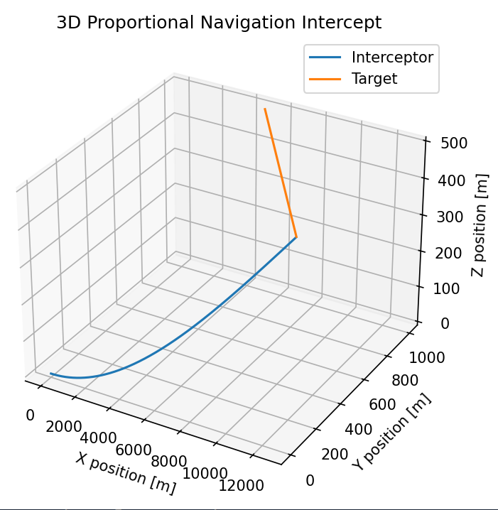
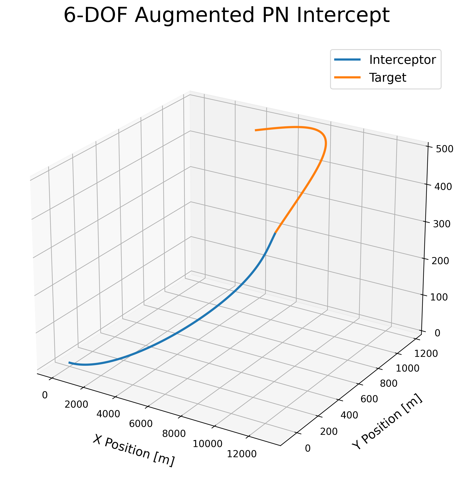
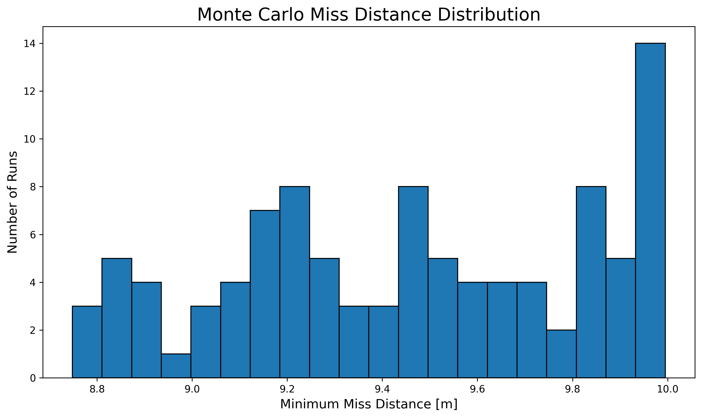
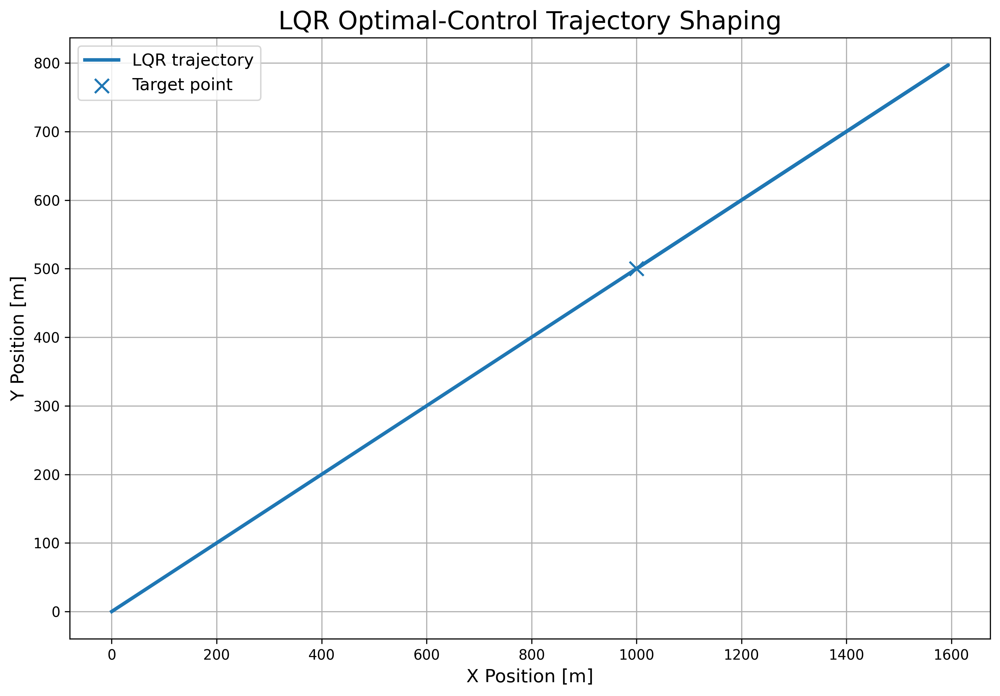

# 6-DOF Interceptor Guidance and Optimal Control Simulation

## Motivation
This project demonstrates guidance, navigation, and control concepts relevant to high-speed agile aerospace platforms.

## Overview

Python-based aerospace GNC simulation project demonstrating interceptor guidance laws, simplified 6-DOF dynamics, trajectory shaping, and optimal-control concepts for agile aerospace platforms.

---

## Features

- 3D Proportional Navigation (PN) guidance (Augmented PN guidance)
- Simplified 6-DOF interceptor dynamics
- Maneuvering target engagement
- Monte Carlo simulation framework - miss-distance analysis
- LQR-based optimal-control trajectory shaping
- 3D trajectory visualization
- Aerospace-oriented simulation architecture

---

## Requirements

- Python 3.10+
- NumPy
- Matplotlib

Install dependencies:

```bash
pip install -r requirements.txt
```

## Running the Simulations

### Guidance Demo
```
python main_guidance_demo.py
```

### Monte Carlo Validation
```
python main_monte_carlo.py
```

### Optimal Control Demo
```
python main_optimal_control_demo.py
```

## 3D Proportional Navigation Guidance Demo

The initial simulation demonstrates a 3D interceptor-target engagement using classical Proportional Navigation (PN) guidance.

### Simulation Parameters

| Parameter | Value |
|---|---|
| Navigation Constant | 3.0 |
| Interceptor Initial Speed | 300 m/s |
| Target Speed | 180 m/s |
| Maximum Acceleration | 120 m/s² |
| Time Step | 0.01 s |

### Results

- Successful intercept achieved
- Intercept time: 42.37 s
- Final miss distance: 4.29 m

### Guidance Visualization

<p align="center">

</p>

## Technical Concepts Demonstrated

- Line-of-sight (LOS) rate estimation
- Closing velocity computation
- 3D intercept geometry
- Mid-course guidance behavior
- Acceleration-command generation
- Real-time simulation loop
- Guidance-command saturation

## 6-DOF Augmented Proportional Navigation Guidance

This simulation demonstrates an interceptor engaging a maneuvering target using Augmented Proportional Navigation (APN). The target performs bounded lateral motion while the interceptor updates its acceleration command using relative position, relative velocity, line-of-sight rate, closing velocity, and target acceleration feedforward.

### Result

| Metric | Value |
|---|---:|
| Intercept time | 43.89 s |
| Minimum miss distance | 9.66 m |
| Navigation constant | 3.0 |
| Target acceleration gain | 0.5 |

### 6-DOF APN Maneuvering Target Intercept Visualization
<p align="center">

</p>

## Monte Carlo Miss-Distance Analysis

A Monte Carlo simulation campaign was performed by randomizing target initial conditions and engagement geometry. This validates robustness of the guidance law across multiple interception scenarios instead of relying on a single deterministic trajectory.

### Monte Carlo Setup

| Parameter | Value |
|---|---:|
| Number of runs | 100 |
| Initial X uncertainty | ±500 m |
| Initial Y uncertainty | ±300 m |
| Initial Z uncertainty | ±100 m |
| Target velocity uncertainty | ±20 m/s |
| Success criterion | Miss distance < 10 m |

### Results

| Metric | Value |
|---|---:|
| Mean miss distance | 9.46 m |
| Median miss distance | 9.48 m |
| Maximum miss distance | 10.00 m |
| Successful intercepts | 100 / 100 |

### Monte Carlo Miss Distance Visualization

<p align="center">

</p>

## LQR Optimal-Control Trajectory Shaping

This demo uses a discrete-time Linear Quadratic Regulator (LQR) to drive a vehicle from an initial state to a desired target state while balancing position error, velocity damping, and control effort.

### Results

| Metric | Value |
|---|---:|
| Target reached time | 27.20 s |
| Final position error | 0.68 m |
| Final velocity | 0.16 m/s |
| Maximum commanded acceleration | 60.00 m/s² |

### LQR Optimal Control Trajectory
<p align="center">

</p>

## Project Architecture

```text
interceptor-gnc-6dof-optimal-control/
│
├── main_guidance_demo.py
├── main_monte_carlo.py
├── main_optimal_control_demo.py
│
├── src/
│   ├── dynamics/
│   │   ├── interceptor_6dof.py
│   │   ├── rotation_utils.py
│   │   └── target_model.py
│   │
│   ├── guidance/
│   │   ├── proportional_navigation.py
│   │   └── augmented_pn.py
│   │
│   ├── control/
│   │   └── lqr_controller.py
│   │
│   └── simulation/
│
├── results/
│
└── docs/
```

```markdown
## Technical Concepts Demonstrated

### Guidance & Navigation
- Proportional Navigation (PN)
- Augmented Proportional Navigation (APN)
- Line-of-sight (LOS) rate estimation
- Closing velocity computation
- Mid-course and terminal guidance behavior
- Relative motion geometry

### Dynamics & Simulation
- Simplified 6-DOF interceptor dynamics
- Translational and rotational state propagation
- Maneuvering target simulation
- Real-time discrete-time simulation loops
- Acceleration-command saturation

### Validation & Analysis
- Monte Carlo miss-distance analysis
- Guidance robustness evaluation
- Statistical engagement analysis
- Trajectory visualization and validation

### Optimal Control
- Discrete-time Linear Quadratic Regulator (LQR)
- State-space system modeling
- Cost-function weighting
- Trajectory shaping
- Control-effort minimization
```
## Future Improvements

- Full nonlinear 6-DOF rigid-body dynamics
- Aerodynamic force and moment modeling
- Quaternion-based attitude propagation
- Sensor noise and state-estimation integration
- Extended Kalman Filter (EKF) target tracking
- Hardware-in-the-loop (HIL) integration
- Model Predictive Control (MPC)
- PX4 / ROS2 integration

## Summary

This project was developed to demonstrate practical Guidance, Navigation, and Control (GNC) concepts relevant to agile aerospace platforms and interceptor-style engagement problems.

The work combines:
- Guidance-law implementation
- Simplified 6-DOF flight dynamics
- Maneuvering-target interception
- Monte Carlo robustness analysis
- Optimal-control trajectory shaping

The project was intentionally structured to resemble a modular aerospace simulation architecture suitable for future expansion toward higher-fidelity flight dynamics, estimation, and real-time flight software integration.